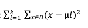
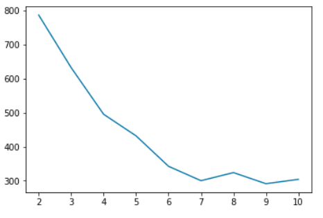
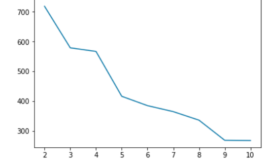
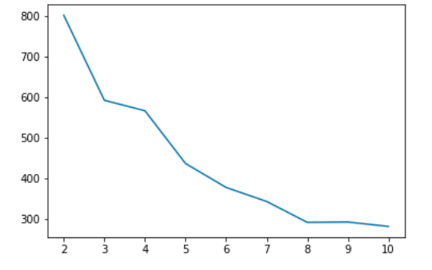
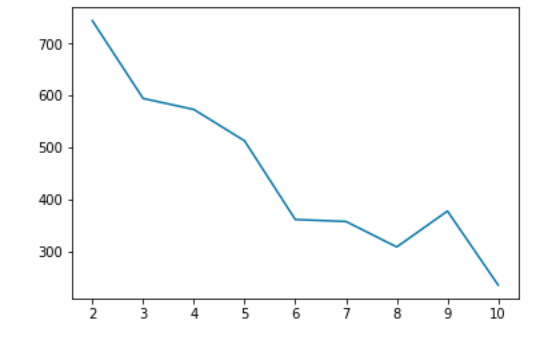

### Dataset used:
The provided data set is an unlabeled dataset with 300 datapoints. It is a dataset with 2
features which is in mat format.
### Language and libraries:
Python language with libraries like numpy, scipy, matplotlib, pandas are used to achieve the
results.

### Methodology:
We use k-means clustering to cluster the dataset into different clusters ranging from 2 to 10.
The distance metric used in the clustering algorithm is Euclidean distance.
In clustering, we select initial points in the following two ways to continue with the clustering
process.
1. Randomly select the initial points
2. Select the point whose distance is furthest from all previous points.
Euclidean distance in a cluster: 

Where k is the number of clusters.
D is the set the cluster belongs to.

Objective function graphs:
Graph between no of clusters and the objective function value for rand initilzation first time.

Similarly, we have graph between no of clusters and the objective function using farthest from
the first method

Using random initialization for second time:

Using farthest from the first for the second time:

### Conclusion:
The objective function, goes down from 800 to 10 as the numbers of clusters increase. This is in
line with what we are expected to get.
